# LongMamba
This repo contains my exploration of Mamba's context scaling. It includes code to: 1. train Mamba on a longer context. 2. evaluate Mamba's PPL on the proof pile test set. 3. perform needle in a haystack test (pass-key retrieval).

At the end of this study,  we managed to make state-spaces/mamba-2.8b-slimpj retrieve nearly perfectly on a context length of 16384. 


I have not polished the code in any way, so please bear with the spaghetti.
## Install
<details>
  <summary>Code</summary>

```bash
conda create -n longmamba python=3.10 -y
conda activate longmamba
pip3 install torch --index-url https://download.pytorch.org/whl/cu118
pip install causal-conv1d>=1.1.0
pip install mamba-ssm
pip install -r requirements.txt
```

</details>

## Mamba Cannot Directly Handle Longer Context
We first run Mamba on the proof pile test set and record the average PPL. We observe that the PPL significantly increases when the context length exceeds Mamba's training length (2048). 
<details>
  <summary>Code</summary>

```bash
python eval.py \
    --tokenized PY007/tokenized_proof_pile_test_neox \
    --dataset-min-tokens 32768 \
    --samples 20 \
    --output-file data/original_mamba.csv \
    --min-tokens 2048 \
    --max-tokens 12288 \
    --tokens-step 2048 \
    --truncate \
    -m state-spaces/mamba-2.8b-slimpj \
    -m state-spaces/mamba-2.8b \
    -m state-spaces/mamba-1.4b \
    -m state-spaces/mamba-790m \
    -m state-spaces/mamba-370m \
    -m state-spaces/mamba-130m
python plot.py --xmax 12288 --ymax 20 data/original_mamba.csv
```
</details>
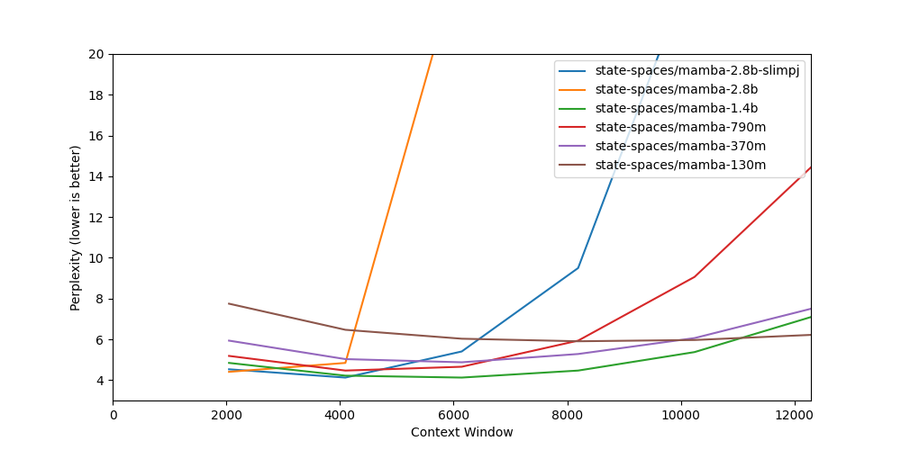

To further validate this phenomenon, let's look at the plot below from [Mamba's ICLR rebuttal](https://openreview.net/forum?id=AL1fq05o7H) (unfortunately the paper not accepted). It was generated by taking the validation set of the Pile dataset, feeding in each example with no padding or concatenation, and measuring the loss per token.
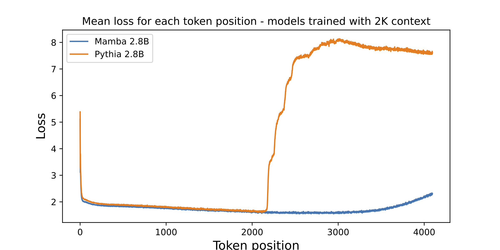


## Preliminary Studies
Mamba is only trained on sequence length up to 2048. It is possible that sequences longer than this are considered Out of Distribution (OOD) for it. But what if we just tweak the positional embeddings to make it think it's still at position 2048, similar to how positional interpolation functions in Transformers (https://arxiv.org/abs/2306.15595 and https://kaiokendev.github.io/til)?
Mamba does not use positional embeddings, unlike Transformers. Instead, it is position-aware through its causal RNN-like architecture. However the underlying state space model does have a term to control the discretization of the context, and I find it quite similar to the positional embeddings in Transformer. Figure 2 from the MambaByte paper gives a very good illustration.

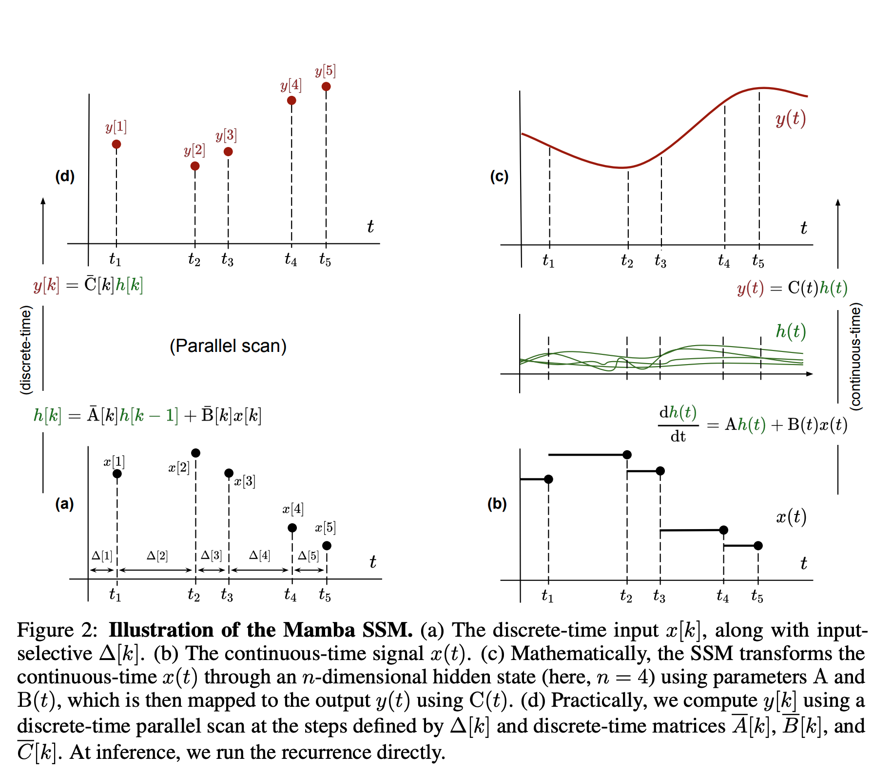

Suppose we want Mamba to operate within a 4096-token context, to make it think it's still operating at 2048, we can simply decrease the delta to one-half of the original value. Since the delta value is input-depedent in mamba, I simply multiply every input-dependent delta with 1/2.
<details>
  <summary>Code</summary>

```bash
python eval.py \
    --tokenized PY007/tokenized_proof_pile_test_neox \
    --dataset-min-tokens 32768 \
    --samples 20 \
    --output-file data/original_mamba_delta_ratio_0.5.csv \
    --min-tokens 2048 \
    --max-tokens 12288 \
    --tokens-step 2048 \
    --truncate \
    -m state-spaces/mamba-2.8b-slimpj \
    --delta_ratio 0.5
python plot.py --xmax 12288 --ymax 20 data/original_mamba_delta_ratio_0.5.csv
```
</details>

This approach appears to work, although the PPL for shorter contexts worsens. Note that I did not finetune the model in any way up till now.

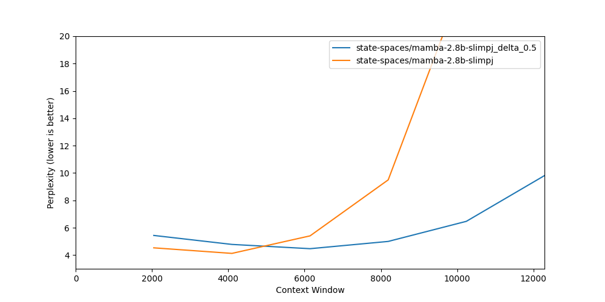


The very obvious next thing to do is to train Mamba on a longer context with the delta value halved, and we can use Mamba directly trained on a longer context as a baseline. 
To avoid unnecessary confounders, I choose state-spaces/mamba-2.8b-slimpj and train on a [subsample of slimpajama](DKYoon/SlimPajama-6B), the same dataset that Mamba is pretrained on.
<details>
  <summary>Code</summary>

```bash
accelerate launch --num_processes 8  train.py --batch-size 1 --gradient-accumulate-every 8  --output-dir ./output/slim_delta_1.0_legnth_4096_step_100_lr_2e-5 \
--wandb longmamba  --model state-spaces/mamba-2.8b-slimpj --dataset PY007/tokenized_slim6B_train_neox_4096 --max-train-steps 100   --learning-rate 2e-5
accelerate launch --num_processes 8  train.py --batch-size 1 --gradient-accumulate-every 8  --output-dir ./output/slim_delta_0.5_legnth_4096_step_100_lr_2e-5 \
--wandb longmamba  --model state-spaces/mamba-2.8b-slimpj --dataset PY007/tokenized_slim6B_train_neox_4096 --max-train-steps 100   --learning-rate 2e-5 --delta_ratio 0.5
```
</details>

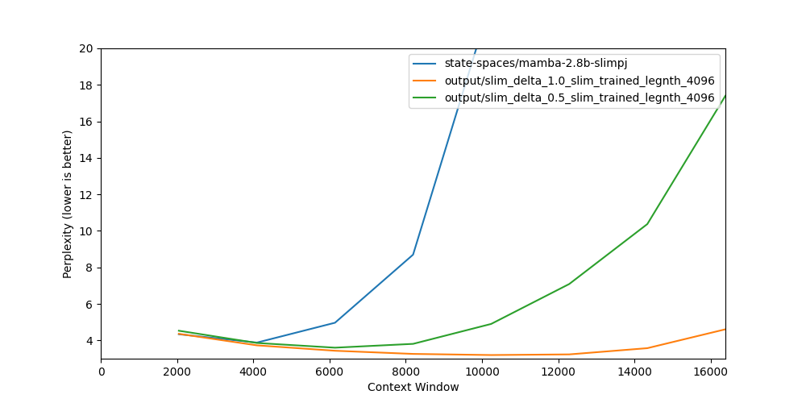

Turns out that halving the delta value performs worse than the baseline. What surprises me is how good the baseline is doing: it is only trained on 2048 --> 4096 context, but it generalizes to sequence length up to 12288. This is a very good sign that Mamba is capable of handling longer context without bells and whistles! 

## Start Baking
I then train mamba-2.8b-slimpj on 16384 context length, the longest that I can fit with 8 A100 80GB and FSDP Fully Shard enabled. The nice thing is it only takes 9 hours.
<details>
  <summary>Code</summary>

```bash
accelerate launch --num_processes 8  train.py --batch-size 1 --gradient-accumulate-every 16  --output-dir ./output/2.8B_slim_legnth_16384_step_400_lr_3e-5 \
--wandb longmamba  --model state-spaces/mamba-2.8b-slimpj --dataset PY007/tokenized_slim6B_train_neox_16384  --max-train-steps 400   --learning-rate 3e-5
# Model is uploaded to https://huggingface.co/PY007/LongMamba_16384_bs128_step400
python eval.py \
    --tokenized PY007/tokenized_proof_pile_test_neox \
    --dataset-min-tokens 65536 \
    --samples 20 \
    --output-file data/LongMamba_16384_bs128_step400.csv \
    --min-tokens 2048 \
    --max-tokens 65536 \
    --tokens-step 2048 \
    --truncate \
    -m PY007/LongMamba_16384_bs128_step400 \
    -m state-spaces/mamba-2.8b-slimpj
python plot.py --xmax 65536 --ymin 2 --ymax 10 data/LongMamba_16384_bs128_step400.csv
python plot.py --xmax 65536 --ymin 2 --ymax 4 data/LongMamba_16384_bs128_step400.csv
```
</details>

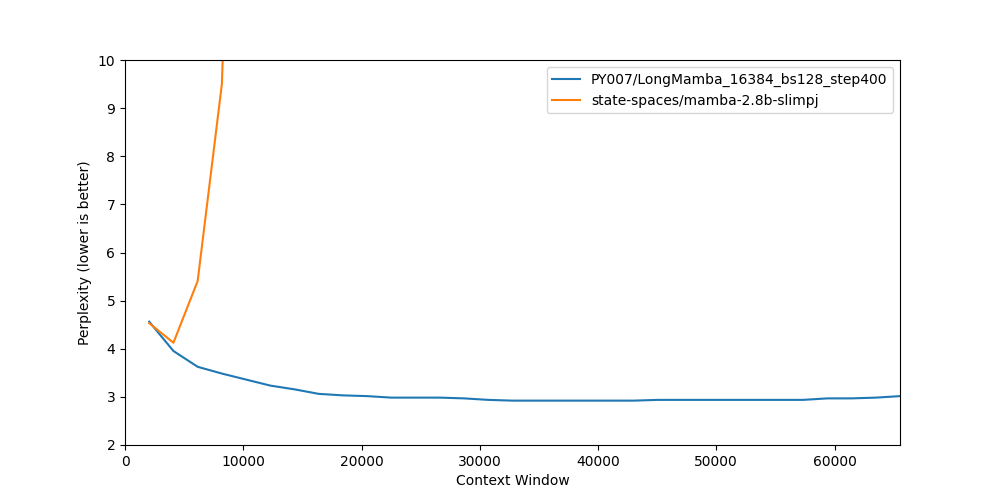

A closer look:

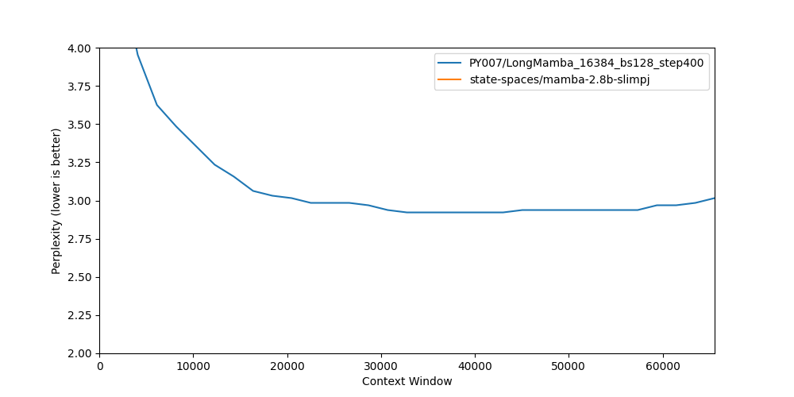


This time it is just doing so good. The PPL keeps decreasing till 40K. Even after 40K, it just increases a little bit rather than directly exploding.

Only the PPL test is not enough though. We need to see whether can it really memorize things. To do this, I follow [LongLora](https://arxiv.org/abs/2309.12307) and test my model with pass-key retrieval. Here is what the task looks like:

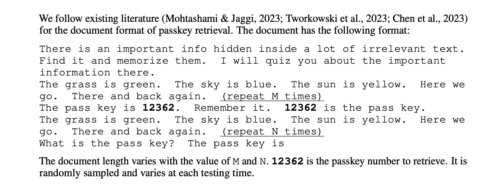

Note that this test is slightly different from https://github.com/gkamradt/LLMTest_NeedleInAHaystack ;in our case, the 'haystack' consists of a single sentence repeated N and M times, while in https://github.com/gkamradt/LLMTest_NeedleInAHaystack, the haystack is an actual document.

<details>
  <summary>Code</summary>

```bash
python pass_key.py --max_tokens 16384 --num_tests 5
python pass_key.py --max_tokens 32768 --num_tests 5
```

</details>


It can be observed that the model retrieves nearly perfectly on 16384. We can further test on 32768 tokens, and see if it still works well.

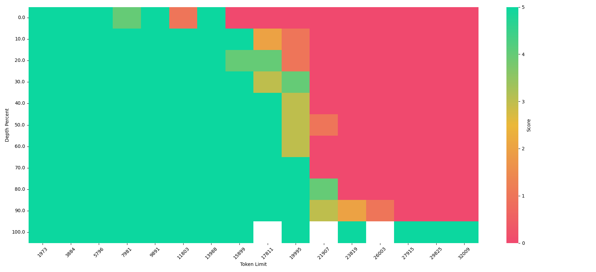

It is interesting to see how Mamba starts to forget the beginning of the context when we increase the context length, which is very different from the Transformer that [lost in the middle](https://arxiv.org/abs/2307.03172).

## Scaling to Infinity

The maximum training length we can attain is still bounded by the limited GPU memory (in my case 16384 on 8 A100 80G). To overcome this, we can train Mamba in a Transformer-XL style. That is, for each batch, instead of initializing the SSM hidden states with zeros, we initialize them with the hidden states from the previous batch. 

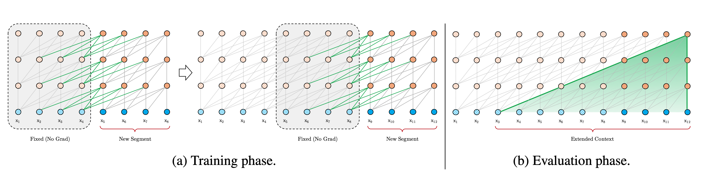

What is more, the RNN-like architecture of Mamba gives us another unique advantage: for Transformer-XL, its extended context length is still bounded by the maximum KV cache it can store, while for Mamba, its context cache (the hidden states) does not grow with the context length! This means theoretically we can scale the context length to infinity!

Suppose we set the sequence length within a single batch as 2048. One caveat is that we should no longer randomly shuffle the 2048 chunk in our data loading script. We should load the data in a sequential manner such that for documents longer than 2048, the first 2048 tokens are in the first batch, the next 2048 tokens are in the second batch, and so on. We can still shuffle the documents, but we should not shuffle the tokens within a document.

This idea really excites me. Unfortunately, the current Mamba implementation does not support this. 

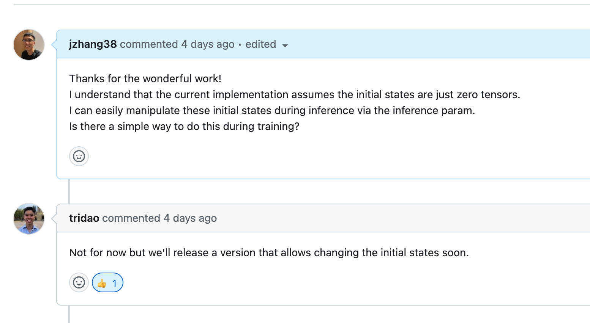

Instead of tweaking the CUDA code myself. I decided to wait for CUDA Master Tri Dao to implement this feature, because I am not confident that I can do it efficiently and correctly.

What I can do, however, is to modify the torch code. Code written in torch is obviously not as efficient as the CUDA code, and may use significantly more memory. But at least I can try out the smallest Mamba model and use it as a proof of concept.

<details>
  <summary>Code</summary>
```bash
# This is really slow (4 hours on 8 A100 40G)
accelerate launch --num_processes 8  train-infinite.py --batch-size 1 --gradient-accumulate-every 2  --output-dir ./output/130m-infinite-lr-6e-5-1024-window-bs-16k-step200 \
--wandb longmamba  --model state-spaces/mamba-130m --dataset PY007/tokenized_slim6B_train_neox_1024  --max-train-steps 200   --learning-rate 6e-5
```
</details>

The training is not very stable .. 


## References
This repository borrows code from the [Mamba repo](https://github.com/state-spaces/mamba) and the [yarn repo](https://github.com/jquesnelle/yarn).
